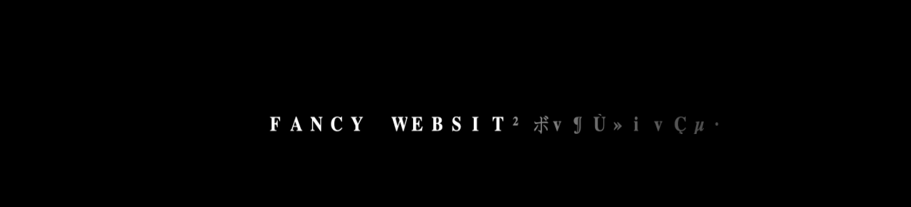

<h1 align="center">Fancy Text Reveal Decoding Shader Project</h1>



## Description

This project leverages the power of WebGL via Three.js and GLSL shaders to present a captivating text decoding experience. It showcases five distinctive text reveal effects, each with its unique animation style that can be used for website intro animations, etc.

## Deployed Version

For live demo please visit 👉 https://text-decoder-alpha.vercel.app/

## Technologies

The project uses the following technologies:

- Three.js for 3D WebGL rendering
- GLSL Shaders for custom graphical effects
- GSAP for robust and smooth animations
- lil-gui for an interactive GUI for controlling shader parameters
- Vite as a modern and fast build tool, configured to support GLSL

## Setup Instructions

Please follow these setup instructions to get the project running locally:

### Prerequisites

- Node.js installed on your system.

### Installation

Clone the repository and install dependencies:

```bash
git clone https://github.com/hkzone/fancy-text-decoder-shader-threejs.git
cd fancy-text-decoder-shader-threejs
npm install
```

Run the development server:

```bash
npm run dev
```

Build for production:

```bash
npm run build
```

The production-ready files will be in the `dist/` folder.

## Shader Features

Each of the five text decoding effects is meticulously crafted to showcase various visual styles.

### Uniforms

The shader uses several uniform variables including time, resolution, and textures to drive the animation logic.

### Functions

text(): Creates the visual representation of text characters from a sprite sheet texture.
shine(): Adds light and contrast dynamics to the text to emphasize the decoding effect.
main(): Serves as the entry point for fragment shader operations to render the final visual effect to the screen.

## Uniforms Control

`lil-gui` is used to create a GUI for live interaction with shader uniforms. Press 'h' to toggle the controls visibility in the UI.

## Project Structure

- `src/script.js`: Main JavaScript entry point for setting up the project and controling the logic.
- `src/style.css`: Styles for the canvas and any HTML UI.
- `src/rendering.js`: Sets up the Three.js rendering.
- `src/shaders/`: Directory containing GLSL shader files (`.glsl`).

## Contributing

If you'd like to contribute, please fork the repository, create a feature branch, and submit a pull request with your changes.

## License

This work is licensed under a Creative Commons Attribution-NonCommercial 4.0 International License. For more information, see `LICENSE` or visit [Creative Commons License](https://creativecommons.org/licenses/by-nc/4.0/)

## Social

Made By [Vitaliy Vlasyuk @_hkzone_](https://twitter.com/_hkzone_)

[Twitter](https://twitter.com/_hkzone_) - [Portfolio](https://vitaliyvlasyuk.com/) - [Github](https://github.com/hkzone)
